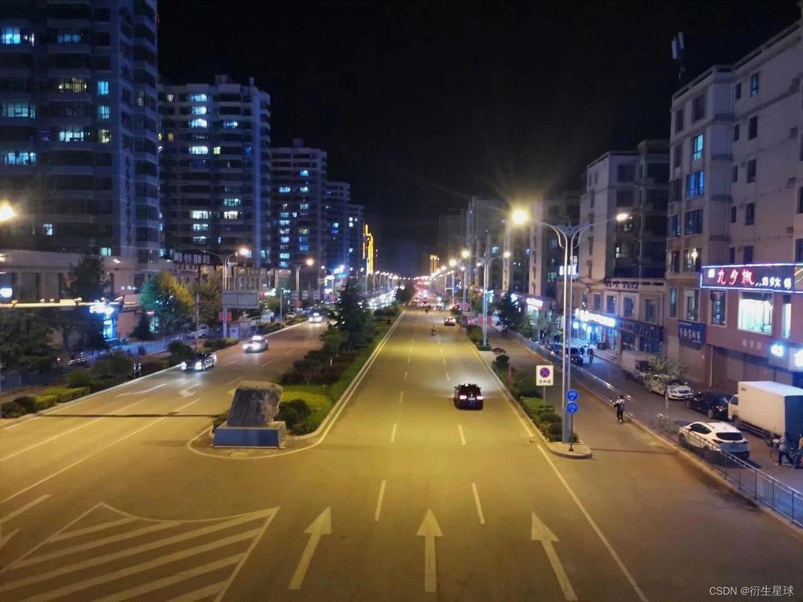

# Image-Convertor
A Image convert tool used to transfer images from RGB_256 to RGB_16, using a HVS-based enhancement of Floyd-Steinberg algorithm

## Usage

```
python3 transfer.py inputfile outputfile Q k1
```

inputfile and outputfile is the root of the image

Q and k1 is the parameter of the model.(default Q=1,k1=0.1)

Comparison:

### round


### Floyd-Steinberg


### HVS-FS



To be continued...
